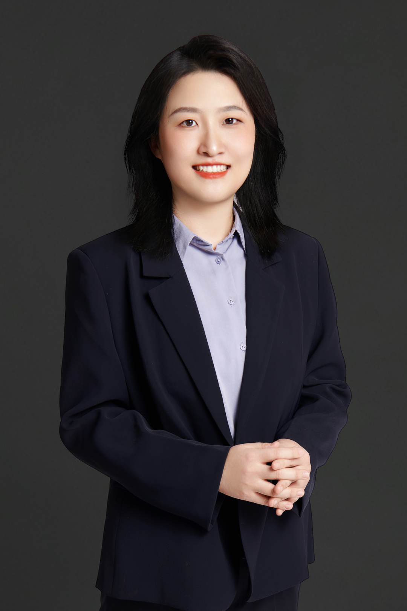

# About Me

Lanjun received her Ph.D. in Electronic Engineering from Tsinghua University in 2011, and in the same year, she joined IBM Research-China. Before that, she was a member of Academic Talent Program 2001 at Tsinghua University and received B.S. degree in Math and Physics in 2005. After 10 year working in the industry, Lanjun was back to academia in 2021. Now she is a Researcher(=full professor) and doctoral supervisor at the School of New Media and Communication, Tianjin University. 
 
Her scholarly pursuits are anchored in the realm of **Responsible Artificial Intelligence**. Lanjun is committed to crafting interpretable, robust, fair, privacy-preserving, and transparent artificial intelligence systems. Additionally, she delves into the realm of **data valuation and pricing**, aiming to harness data as a pivotal factor of production.

> [Recruiting]:  Looking for prospective PhD students and Master students who will be enrolling in 2026.   Ideal candidates are expected to be **responsible**, **organized**, and **creative**. Strong *programming* skills, solid *mathematics* knowledge as well as good *communication* skills are preferred.  Please send your **CV**, **Transcript** and a brief **Summary** of your experience (in email). 

---
## Work Experience
- **2021.10-Present:** Tianjin University, Researcher
- **2017.5-2021.10:** Huawei Technologies, Technical Expert
- **2016.2-2017.5:** University of Waterloo, Postdoctoral Research Fellow
- **2011.7-2016.1:** IBM Research-China, Research Staff Member

## Education Experience
- **2005-2011:** Tsinghua University, EE,  PhD
- **2001-2005:** Tsinghua University, Math & Physics, B.S.
- **2008-2009:** University of California, Berkeley, Visiting student

---
## News
- *Mar 25, 2024*: Our paper **Toward Chinese Food Understanding: a Cross-Modal Ingredient-Level Benchmark** is accepted by IEEE Transaction on Multimedia (TMM, JCR:Q1).  Congrats to Chenyu and the team! Appreciate supports from Meituan.
- *Mar 13, 2024*: Our paper **Rumor Detection Framework Based on Multi-source Knowledge Adaptation** is accepted by ICME (CCF-B).  Congrats to Jingqiu! This is an upgraded version on her previous study (MM'23).
- *Feb 27, 2024*: Our paper **AnyScene: Customized Image Synthesis with Composited Foreground** is accepted by CVPR (CCF-A).  Congrats to Ruidong! This is our first paper on controlable image generation.
- *Feb 24, 2024*: Our paper **MCDAN: a Multi-scale Context-enhanced Dynamic Attention Network for Diffusion Prediction** is accepted by IEEE Transaction on Multimedia  (TMM, JCR:Q1).  Congrats to Xiaowen!  This is our first paper on information diffusion prediction.

